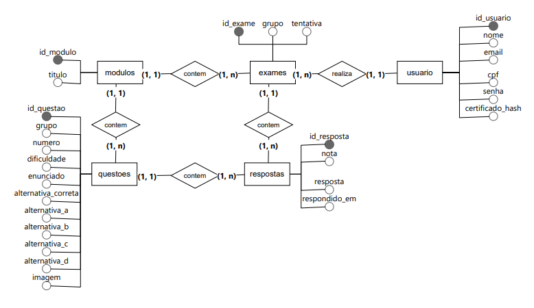
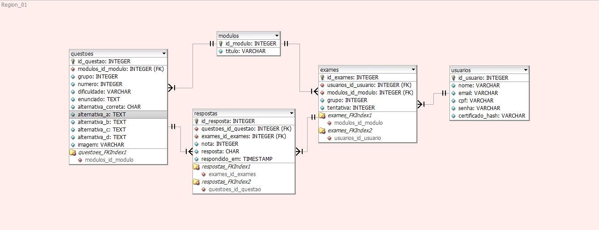

# 📝 Diagramas do Banco de Dados

Esta pasta reúne toda a documentação relacionada à modelagem e estruturação do banco de dados da aplicação, incluindo diagramas conceituais e lógicos utilizados no desenvolvimento do sistema.

A modelagem do banco de dados foi definida durante a [Sprint 1](../../README.md#sprint1) pelo membro:

- [Gabriel Gomes](https://github.com/gabrielgomesfernandes)

---

## 📁 Estrutura da Pasta

| Documento | Descrição |
|---|---|
| `Modelo_Conceitual.png` | Representação conceitual das entidades e relacionamentos do banco de dados |
| `Modelo_Logico.png` | Representação lógica da estrutura do banco de dados e suas tabelas |

---

## 🎯 Objetivos da Modelagem

A estrutura do banco de dados foi desenvolvida com foco em:

- Organização das informações
- Integridade dos dados
- Escalabilidade
- Facilidade de manutenção
- Eficiência nos relacionamentos entre entidades

---

## 🛠️ Ferramentas Utilizadas

### BR Modelo

Ferramenta utilizada para a criação do modelo conceitual do banco de dados, permitindo a representação das entidades, atributos e relacionamentos da aplicação.

 

### DBDesigner 4

Ferramenta utilizada para a construção do modelo lógico do banco de dados, auxiliando na definição das tabelas, chaves e relacionamentos do sistema.

---

## 📝 Diagramas

### Modelo Conceitual

    

### Modelo Lógico

    

