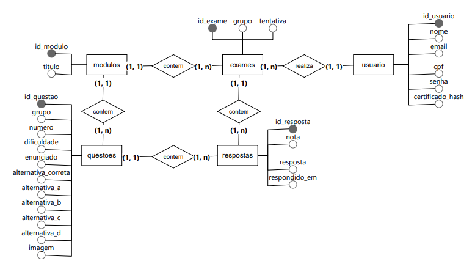
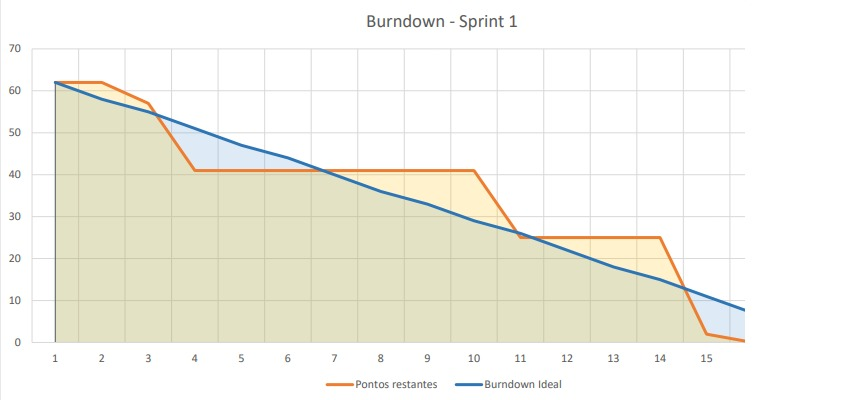

# ABP-1DSM

This repository has been created for publish our first project (Scrum learning website).

<h1 align="center">📘 Portal de Certificação em Métodologia Ágil – ABP</h1>

## 📌 Descrição do Projeto

Este projeto consiste no desenvolvimento de um **portal web para certificação interna em metodologias ágeis**, com foco em **Scrum**, como parte da Atividade Baseada em Projeto (ABP).

A aplicação permite que usuários se cadastrem, realizem avaliações organizadas por níveis de dificuldade e acompanhem sua evolução, culminando na emissão de um certificado com base no desempenho.

## 🎯 Objetivo Educacional

Integrar, em um único projeto prático, os principais conteúdos do semestre:

- Desenvolvimento de interfaces com **HTML, CSS e JavaScript (sem uso de frameworks)**
- Persistência de dados utilizando **PostgreSQL**
- Aplicação de **metodologias ágeis (Scrum)**
- Documentação do projeto com **UML**
- Organização e execução de projeto em equipe

## Sprints

| Sprint | Link                            | Início     | Entrega    | Status |
| ------ | ------------------------------- | ---------- | ---------- | ------ |
| 01     | <a href="#sprint1">Sprint 1</a> | 13/04/2026 | 30/04/2026 | 🔄     |
| 02     | <a href="#sprint2">Sprint 2</a> | 04/06/2026 | 21/05/2026 | ❌     |
| 03     | <a href="#sprint3">Sprint 3</a> | 25/05/2026 | 11/06/2026 | ❌     |

---

## 👥 Equipe

| Nome               | Função        | GitHub                                                            |
| ------------------ | ------------- | ----------------------------------------------------------------- |
| Douglas Silva      | Scrum Master  | [Moraisdouglas](https://github.com/moraisdouglas)                 |
| Henrique Martins   | Product Owner | [Henri-Bueno](https://github.com/Henri-Bueno)                     |
| Gabriel Gomes      | Desenvolvedor | [gabrielgomesfernandes](https://github.com/gabrielgomesfernandes) |
| Jaqueline Medeiros | Desenvolvedor | [Jaqueline Medeiros](https://github.com/alves-medeiros)           |
| Paulo Olivetti     | Desenvolvedor | [pauloolivetti](https://github.com/pauloolivetti)                 |
| Tiago Ferreira     | Desenvolvedor | [tiagof6](https://github.com/tiagof6)                             |
| Vítor Otavio       | Desenvolvedor | [VirtusXD](https://github.com/VirtusXD)                           |

## 🛠️ Ferramentas utilizadas

<a href="https://www.w3.org/html/" target="_blank" rel="noreferrer">

<a/>  
<a href="https://www.w3schools.com/css/" target="_blank" rel="noreferrer">

<a/>  
<a href="https://developer.mozilla.org/en-US/docs/Web/JavaScript" target="_blank" rel="noreferrer">

<a/>  
<a href="https://nodejs.org/pt" target="_blank" rel="noreferrer">

<a/>  
<a href="https://www.figma.com/pt-br/" target="_blank" rel="noreferrer">

<a/>  
<a href="https://www.postgresql.org/" target="_blank" rel="noreferrer">

<a/>  
<a href="https://git-scm.com/" target="_blank" rel="noreferrer">

<a/>  
<a href="https://github.com/" target="_blank" rel="noreferrer">

<a/>  

---

## 📝 Product Backlog

### Requisitos Funcionais

| Requisitos Funcionais | Requisitos                                                          | Sprint       | Prioridade |
| --------------------- | ------------------------------------------------------------------- | ------------ | ---------- |
| RF-01                 | Autenticação de usuários (cadastro e login)                         | #01          | Alta       |
| RF-02                 | Interface visual e prototipação do sistema.                         | #01          | Alta       |
| RF-03                 | Integração entre interface, backend e banco de dados.               | #01   #02 | Alta       |
| RF-04                 | Sistema de avaliação por níveis (questões, tentativas e pontuação). | #01   #02 | Alta       |
| RF-05                 | Sistema de progressão e acompanhamento do usuário.                  | #02          | Média      |
| RF-06                 | Cálculo de desempenho final e emissão de certificado.               | #03          | Média      |
| RF-07                 | Responsabilidade visual e experiência de navegação do usuário.      | #03          | Média      |
| RF-08                 | Área administrativa para gerenciamento do sistema.                  | #03          | Baixa      |

 

### Requisitos Não Funcionais

| Requisitos Não Funcionais | Requisitos                                                 | Sprint                | Prioridade |
| ------------------------- | ---------------------------------------------------------- | --------------------- | ---------- |
| RNF-01                    | Responsividade e adaptabilidade entre dispositivos.        | #02   #03          | Alta       |
| RNF-02                    | Desempenho e eficiência de carregamento.                   | #02   #03          | Média      |
| RNF-03                    | Segurança e proteção de dados dos usuários.                | #02                   | Alta       |
| RNF-04                    | Validação e integridade das regras de negócio no back-end. | #02                   | Alta       |
| RNF-05                    | Interface clara, navegável e de fácil utilização.          | #01   #02   #03 | Média      |
| RNF-06                    | Documentação técnica do projeto.                           | #03                   | Média      |

### User Stories

| Id_Referência                                  | Remetente | Instrução                                                                          | Finalidade                                                           |
| ---------------------------------------------- | --------- | ---------------------------------------------------------------------------------- | -------------------------------------------------------------------- |
| RF-01, RF-02                                   | Cliente   | Como cliente, quero poder visualizar um protótipo do site                          | Para entender sua estrutura e funcionalidades                        |
| RF-03, RF-04                                   | Cliente   | Como cliente, eu quero que os usuários consigam se cadastrar no site e fazer login | Para terem acesso ao conteúdo do curso                               |
| RF-05, RF-06, RF-07, RF-08, RF-09, RF-10       | Usuário   | Como usuário, quero realizar o conteúdo do curso de maneira organizada             | Para adquirir conhecimento com o conteúdo do curso                   |
| RF-11, RF-12, RF-13                            | Usuário   | Como usuário, quero emitir meu certificado                                         | Para concluir o curso                                                |
| RNF-02, RNF-03, RNF-04, RNF-06, RNF-07, RNF-08 | Cliente   | Como cliente quero um site intuitivo, responsivo e seguro                          | Para que usuários se sintam seguros e confortáveis utilizando o site |
| RNF-08                                         | Cliente   | Como cliente, quero que o site tenha uma documentação básica                       | Para o entendimento da execução técnica do site                      |

## Modelo Conceitual

---

# 
Sprint 1

## 🔄 SprintBacklog 1

| Atividade                                                                  | Responsável                | Tarefa concluída | Pontos | Requisito               |
| -------------------------------------------------------------------------- | -------------------------- | ---------------- | ------ | ----------------------- |
| Base do servidor backend com automação de banco (DB init e rotas iniciais) | Equipe                     | ✅               | 8      | RF-03 RF-04 RNF-04      |
| Diagrama de Casos de Uso (UML)                                             | Henrique                   | ✅               | 5      | RF-01 RF-04 RF-05 RF-06 |
| Documentação de funcionalidades e elementos das telas                      | Henrique, Tiago, Jaqueline | ✅               | 5      | RF-02 RF-05 RNF-05      |
| Diagrama de fluxo de navegação entre telas                                 | Tiago, Jaqueline           | ✅               | 3      | RF-05 RF-07 RNF-05      |
| Wireframe do layout do site (protótipo inicial)                            | Vitor, Paulo               | ✅               | 5      | RF-02 RNF-05            |
| Definição de responsividade (layouts para mobile e tablet)                 | Vitor, Paulo               | ✅               | 3      | RNF-01 RNF-05           |
| Identidade visual (logo e estilo visual)                                   | Vitor, Paulo               | ✅               | 5      | RF-02 RF-07 RNF-05      |
| Definição de tipografia (com estudo e variações documentadas)              | Paulo                      | ✅               | 3      | RF-07 RNF-05            |
| Definição de paleta de cores (com estudo comparativo documentado)          | Paulo                      | ✅               | 5      | RF-07 RNF-05            |
| Protótipo final (alta fidelidade com interações)                           | Vitor                      | ✅               | 8      | RF-02 RF-07 RNF-05      |
| Modelagem conceitual do banco de dados                                     | Gabriel                    | ✅               | 3      | RF-03 RF-04             |
| Modelagem lógica do banco de dados                                         | Gabriel                    | ✅               | 5      | RF-03 RF-04 RNF-04      |
| Estruturação do repositório GitHub                                         | Gabriel                    | ✅               | 2      | RNF-06                  |
| Configuração do GitHub Projects ( Scrum)                                   | Gabriel                    | ✅               | 2      | RNF-06                  |

## 🔥 Burndown Sprint 1

# 
Sprint 2

**Sprint não iniciada**

# 
Sprint 3

**Sprint não iniciada**
