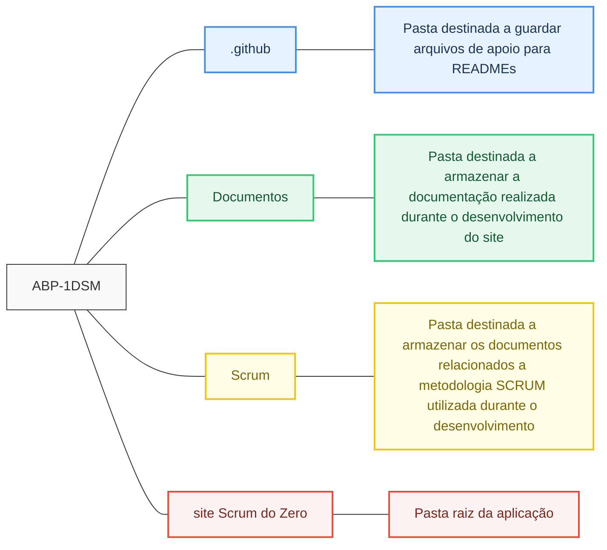
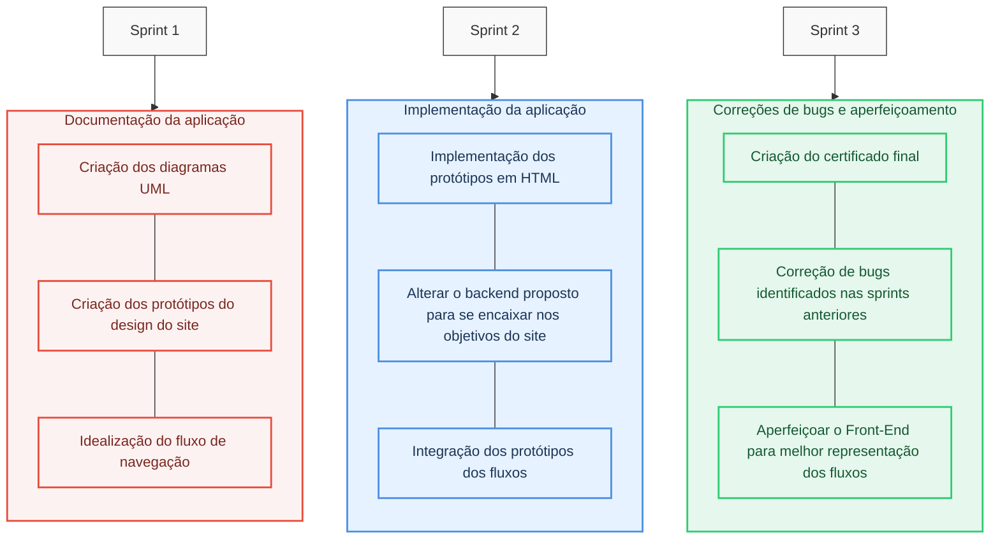
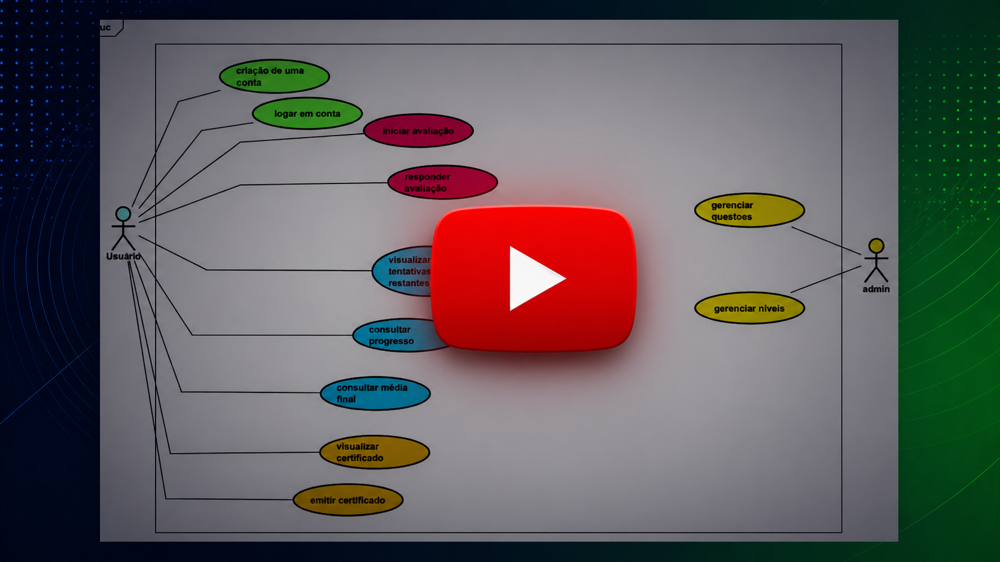
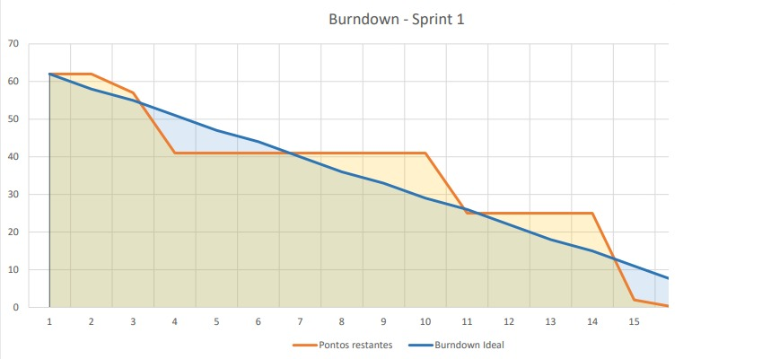
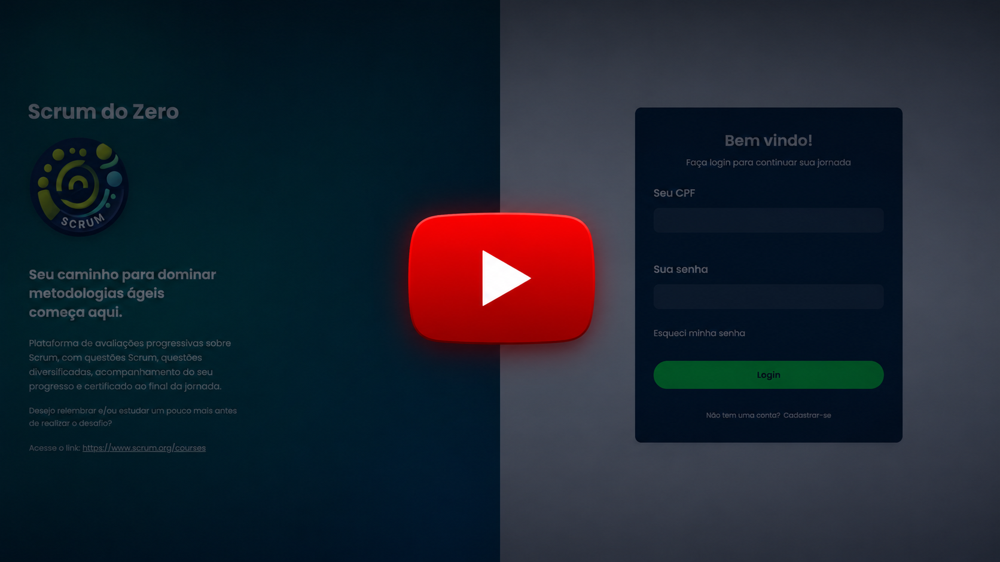
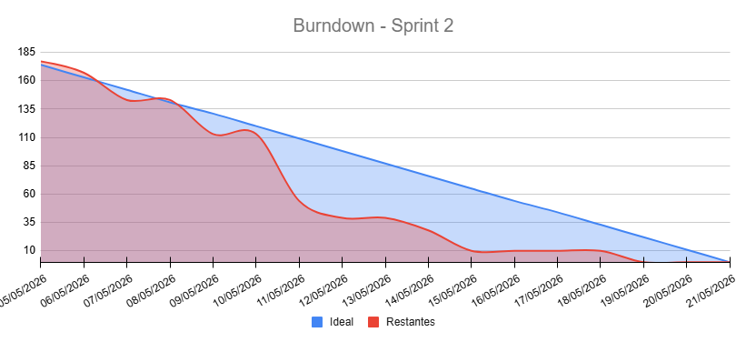
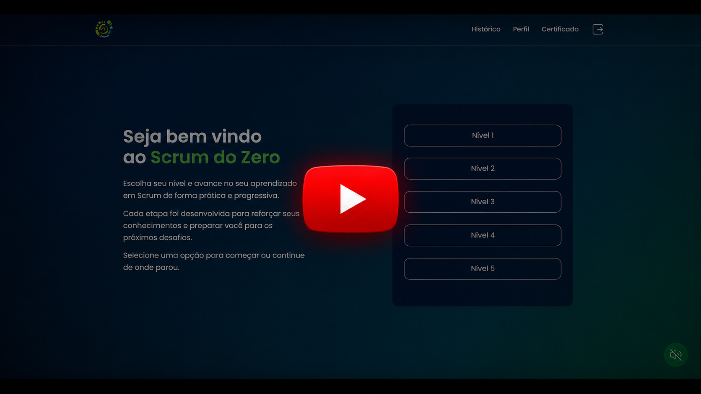
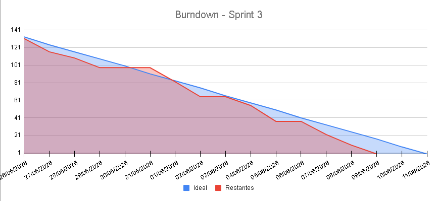

<p align ="center">

</p>

# <h1 align="center">Scrum do Zero</h1>

<p align="center">


</p>

---

## 📋 Índice
<details open>
  <summary><b>Sumário do Projeto</b></summary>

  <ul>
    <li>
      <details>
        <summary><a href="#-descrição-do-projeto">1. Descrição do projeto</a></summary>
        <ul>
          <li><a href="#-objetivo-educacional">1.1. Objetivo educacional</a></li>
          <li><a href="#-ferramentas-utilizadas">1.2. Ferramentas utilizadas</a></li>
          <li><a href="#-como-iniciar-a-aplicação">1.3. Como iniciar a aplicação</a></li>
          <li><a href="#sprints">1.4. Tabela e programação das sprints</a></li>
          <li><a href="#-funcionalidades">1.5. Funcionalidades</a></li>
          <li><a href="#-equipe">1.6. Equipe</a></li>
          <li><a href="#-product-backlog">1.7. Product backlog</a></li>
          <li><a href="#diagrama-de-caso-de-uso">1.8. Diagrama de caso de uso</a></li>
          <li><a href="#modelo-conceitual">1.9. Modelo conceitual</a></li>
        </ul>
      </details>
    </li>
    <li>
      <details>
        <summary><a href="#sprints">2. Sprints</a></summary>
        <ul>
          <li>
            <details>
              <summary><a href="#sprint-1">2.1. Sprint 1</a></summary>
              <ul>
                <li><a href="#-video-da-sprint-1">2.1.1. Vídeo da Sprint 1</a></li>
                <li><a href="#-sprint-backlog-1">2.1.2. Sprint backlog 1</a></li>
                <li><a href="#-burndown-sprint-1">2.1.3. Sprint burndown 1</a></li>
                <li><a href="#sprint-retrospective-1">2.1.4. Sprint retrospective 1</a></li>
              </ul>
            </details>
          </li>
          <li>
            <details>
              <summary><a href="#sprint-2">2.2. Sprint 2</a></summary>
              <ul>
                <li><a href="#-video-da-sprint-2">2.2.1. Vídeo da Sprint 2</a></li>
                <li><a href="#-sprint-backlog-2">2.2.2. Sprint backlog 2</a></li>
                <li><a href="#-burndown-sprint-2">2.2.3. Sprint burndown 2</a></li>
                <li><a href="#sprint-retrospective-2">2.2.4. Sprint retrospective 2</a></li>
              </ul>
            </details>
          </li>
          <li>
            <details>
              <summary><a href="#sprint-3">2.3. Sprint 3</a></summary>
              <ul>
                <li><a href="#-video-da-sprint-3">2.3.1. Vídeo da Sprint 3</a></li>
                <li><a href="#-sprint-backlog-3">2.3.2. Sprint backlog 3</a></li>
                <li><a href="#-burndown-sprint-3">2.3.3. Sprint burndown 3</a></li>
                <li><a href="#sprint-retrospective-3">2.3.4. Sprint retrospective 3</a></li>
              </ul>
            </details>
          </li>
        </ul>
      </details>
    </li>
  </ul>
</details>

## 📌 Descrição do Projeto

Este projeto consiste no desenvolvimento de um **portal web para certificação interna em metodologias ágeis**, com foco em **Scrum**, como parte da Atividade Baseada em Projeto (ABP).

A aplicação permite que usuários se cadastrem, realizem avaliações organizadas por níveis de dificuldade e acompanhem sua evolução, culminando na emissão de um certificado com base no desempenho.

<p align="center">
🚧 Projeto em andamento - Sprint 3 focada em correção de bugs e polimento das funcionalidades da aplicação.
</p>

### 🎯 Objetivo Educacional

Integrar, em um único projeto prático, os principais conteúdos do semestre:

- Desenvolvimento de interfaces com **HTML, CSS e JavaScript (sem uso de frameworks)**
- Persistência de dados utilizando **PostgreSQL**
- Aplicação de **metodologias ágeis (Scrum)**
- Documentação do projeto com **UML**
- Organização e execução de projeto em equipe

---

## 📁 Organização de pastas


```mermaid
graph LR
    %% Nó Raiz principal
    raiz["ABP-1DSM"]

    %% --- Fluxo do GitHub (Azul) ---
    raiz --- github[".github"]
    github --- desc.github["Pasta destinada a guardar arquivos de apoio para READMEs"]

    %% --- Fluxo de Documentos (Verde) ---
    raiz --- doc["Documentos"]
    doc --- desc.doc["Pasta destinada a armazenar a documentação realizada durante o desenvolvimento do site"]

    %% --- Fluxo do Scrum (Amarelo) ---
    raiz --- Scrum["Scrum"]
    Scrum --- desc.scrum["Pasta destinada a armazenar os documentos relacionados a metodologia SCRUM utilizada durante o desenvolvimento"]

    %% --- Fluxo do Site (Vermelho) ---
    raiz --- site["site Scrum do Zero"]
    site --- desc.site["Pasta raiz da aplicação"]

    %% --- Aplicação de Cores por Ramificação ---
    class github,desc.github ramoAzul;
    class doc,desc.doc ramoVerde;
    class Scrum,desc.scrum ramoAmarelo;
    class site,desc.site ramoVermelho;

    %% --- Definição das Classes de Estilo ---
    classDef default fill:#f9f9f9,stroke:#333,stroke-width:1px,color:#333;
    classDef ramoAzul fill:#e6f2ff,stroke:#4a90e2,stroke-width:2px,color:#1d3557;
    classDef ramoVerde fill:#e6f7ed,stroke:#2ecc71,stroke-width:2px,color:#145a32;
    classDef ramoAmarelo fill:#fffde6,stroke:#f1c40f,stroke-width:2px,color:#7d6608;
    classDef ramoVermelho fill:#fdf2f2,stroke:#e74c3c,stroke-width:2px,color:#78281f;
```

---


### 🛠️ Ferramentas utilizadas

<table align="center">
    <tbody>
        <tr>
            <td colspan="3" align="center"><b>FrontEnd</b></td>
        </tr>
        <tr>
            <td align="center">
                <a href="https://www.w3.org/html/" target="_blank" rel="noreferrer">
                
                </a><br>HTML5
            </td>
            <td align="center">
                <a href="https://www.w3schools.com/css/" target="_blank" rel="noreferrer">
                
                </a><br>CSS3
            </td>
            <td align="center">
                <a href="https://developer.mozilla.org/en-US/docs/Web/JavaScript" target="_blank" rel="noreferrer">
                
                </a><br>JavaScript
            </td>
        </tr>
        <tr>
            <td colspan="3" align="center"><b>BackEnd</b></td>
        </tr>
        <tr>
            <td colspan="3" align="center">
                <a href="https://nodejs.org/pt" target="_blank" rel="noreferrer">
                
                </a><br>Node.js
            </td>
        </tr>
        <tr>
            <td colspan="3" align="center"><b>Banco de Dados</b></td>
        </tr>
        <tr>
            <td colspan="3" align="center">
                <a href="https://www.postgresql.org/" target="_blank" rel="noreferrer">
                
                </a><br>pgAdmin 4
            </td>
        </tr>
        <tr>
            <td colspan="3" align="center"><b>Design</b></td>
        </tr>
        <tr>
            <td colspan="3" align="center">
                <a href="https://www.figma.com/pt-br/" target="_blank" rel="noreferrer">
                
                </a><br>Figma
            </td>
        </tr>
        <tr>
            <td colspan="3" align="center"><b>Versionamento</b></td>
        </tr>
        <tr>
            <td colspan="3" align="center">
                <table>
                    <tr>
                        <td align="center">
                            <a href="https://git-scm.com/" target="_blank" rel="noreferrer">
                            
                            </a><br>Git
                        </td>
                        <td align="center">
                            <a href="https://github.com/" target="_blank" rel="noreferrer">
                            
                            </a><br>GitHub
                        </td>
                    </tr>
                </table>
            </td>
        </tr>
    </tbody>
</table>

---

### 🚀 Como iniciar a aplicação

Para executar o projeto localmente, siga os passos abaixo:

#### Pré-requisitos

Antes de começar, certifique-se de ter instalado:

- Node.js
- npm
- Git

#### Clone o repositório

- Abra o terminal na pasta desejada

```bash
git clone https://github.com/teamzerodsm/ABP-1DSM.git
```

#### Acesse a pasta do projeto

```bash
cd '.\ABP-1DSM\site Scrum do Zero\'
```

#### Instale as dependências do backend

```bash
npm install
```

#### Configure o arquivo ``.env``

preencha as seguintes configurações do seu banco de dados no arquivo ``ABP-1DSM/site Scrum do Zero/.env``

```bash
PORT= ****

POSTGRES_HOST= ****
POSTGRES_USER= ****
POSTGRES_PASSWORD= ****
POSTGRES_DB= ****
POSTGRES_PORT= ****
```

#### Inicie o banco de dados

```bash
npm run db:init
```

#### Inicie o servidor Node.js

```bash
npm start
```

ou

```bash
npm run dev
```

#### Abra a página do site

- Abra o arquivo `index.html` no navegador ou utilize a extensão **Live Server** no VS Code, caso esteja rodando localmente

---

### Sprints

| Sprint | Link                            | Início     | Entrega    | Status |
| ------ | ------------------------------- | ---------- | ---------- | ------ |
| 01     | <a href="#sprint1">Sprint 1</a> | 13/04/2026 | 30/04/2026 | ✅     |
| 02     | <a href="#sprint2">Sprint 2</a> | 04/05/2026 | 21/05/2026 | ✅     |
| 03     | <a href="#sprint3">Sprint 3</a> | 25/05/2026 | 11/06/2026 | 🔄     |

#### Legenda

✅ - Sprint concluída <br>
🔄 - Sprint em andamento <br>
❌ - Sprint não iniciada

### Cronograma das sprints


```mermaid
  %%{init: {'flowchart': {'curve': 'stepBefore'}}}%%
graph TD
    %% Nós do Diagrama
    s1["Sprint 1"]
    s2["Sprint 2"]
    s3["Sprint 3"]

    %% Setas direcionadas para os subgráficos
    s1 --> DOC
    s2 --> IMP
    s3 --> BUG

    subgraph DOC [Documentação da aplicação]
    direction TD
      a1["Criação dos diagramas UML"]
      a1 --- a2["Criação dos protótipos do design do site"]
      a2 --- a3["Idealização do fluxo de navegação"]
    end

    subgraph IMP [Implementação da aplicação]
    direction TD
      b1["Implementação dos protótipos em HTML"]
      b1 --- b2["Alterar o backend proposto para se encaixar nos objetivos do site"]
      b2 --- b3["Integração dos protótipos dos fluxos"]
    end

    subgraph BUG [Correções de bugs e aperfeiçoamento]
    direction TD
      c1["Criação do certificado final"]
      c1 --- c2["Correção de bugs identificados nas sprints anteriores"]
      c2 --- c3["Aperfeiçoar o Front-End para melhor representação dos fluxos"]
    end

    %% --- Aplicação de Cores por Ramificação ---
    class s1,s2,s3 topoSprint;
    class DOC,a1,a2,a3 ramoVermelho;
    class IMP,b1,b2,b3 ramoAzul;
    class BUG,c1,c2,c3 ramoVerde;

    %% --- Definição das Classes de Estilo Unificadas ---
    classDef default fill:#f9f9f9,stroke:#333,stroke-width:1px,color:#333;
    classDef topoSprint fill:#f9f9f9,stroke:#333,stroke-width:1px,color:#333;
    classDef ramoAzul fill:#e6f2ff,stroke:#4a90e2,stroke-width:2px,color:#1d3557;
    classDef ramoVerde fill:#e6f7ed,stroke:#2ecc71,stroke-width:2px,color:#145a32;
    classDef ramoVermelho fill:#fdf2f2,stroke:#e74c3c,stroke-width:2px,color:#78281f;


```

---

### ✨ Funcionalidades

- Cadastro e login
- Avaliações por níveis
- Progresso do usuário
- Emissão de certificado

---

### 👥 Equipe

| Nome               | Função                       | GitHub                                                            |
| ------------------ | ---------------------------- | ----------------------------------------------------------------- |
| Henrique Martins   | Product Owner                | [Henri-Bueno](https://github.com/Henri-Bueno)                     |
| Paulo Olivetti     | Scrum Master                 | [pauloolivetti](https://github.com/pauloolivetti)                 |
| Gabriel Gomes      | Desenvolvedor                | [gabrielgomesfernandes](https://github.com/gabrielgomesfernandes) |
| Igor Corrêa        | Desenvolvedor                | [igorcsouzaa](https://github.com/igorcsouzaa)                     |
| Jaqueline Medeiros | Desenvolvedor                | [Jaqueline Medeiros](https://github.com/alves-medeiros)           |
| Tiago Ferreira     | Desenvolvedor                | [tiagof6](https://github.com/tiagof6)                             |
| Vitor Otavio       | Desenvolvedor                | [vitorreis-dev](https://github.com/vitorreis-dev)                 |
| Douglas Silva      | Scrum Master (anteriormente) | [Moraisdouglas](https://github.com/moraisdouglas)                 |

---

### 📝 Product Backlog

<details open>
  <summary><b>Especificações do Projeto (Tabelas)</b></summary>
  <br>

  <!-- TABELA 1: REQUISITOS FUNCIONAIS -->
  <details>
    <summary>📌 Requisitos Funcionais</summary>
    <br>
    <table border="1">
      <thead>
        <tr>
          <th>Requisitos Funcionais</th>
          <th>Requisitos</th>
          <th>Sprint</th>
          <th>Prioridade</th>
        </tr>
      </thead>
      <tbody>
        <tr>
          <td>RF-01</td>
          <td>Autenticação de usuários (cadastro e login)</td>
          <td>#01</td>
          <td>Alta</td>
        </tr>
        <tr>
          <td>RF-02</td>
          <td>Interface visual e prototipação do sistema.</td>
          <td>#01</td>
          <td>Alta</td>
        </tr>
        <tr>
          <td>RF-03</td>
          <td>Integração entre interface, backend e banco de dados.</td>
          <td>#01 <br> #02</td>
          <td>Alta</td>
        </tr>
        <tr>
          <td>RF-04</td>
          <td>Sistema de avaliação por níveis (questões, tentativas e pontuação).</td>
          <td>#01 <br> #02</td>
          <td>Alta</td>
        </tr>
        <tr>
          <td>RF-05</td>
          <td>Sistema de progressão e acompanhamento do usuário.</td>
          <td>#02</td>
          <td>Média</td>
        </tr>
        <tr>
          <td>RF-06</td>
          <td>Cálculo de desempenho final e emissão de certificado.</td>
          <td>#03</td>
          <td>Média</td>
        </tr>
        <tr>
          <td>RF-07</td>
          <td>Responsividade visual e experiência de navegação do usuário.</td>
          <td>#03</td>
          <td>Média</td>
        </tr>
        <tr>
          <td>RF-08</td>
          <td>Área administrativa para gerenciamento do sistema.</td>
          <td>#03</td>
          <td>Baixa</td>
        </tr>
      </tbody>
    </table>
  </details>

  <br>

  <!-- TABELA 2: REQUISITOS NÃO FUNCIONAIS -->
  <details>
    <summary>⚙️ Requisitos Não Funcionais</summary>
    <br>
    <table border="1">
      <thead>
        <tr>
          <th>Requisitos Não Funcionais</th>
          <th>Requisitos</th>
          <th>Sprint</th>
          <th>Prioridade</th>
        </tr>
      </thead>
      <tbody>
        <tr>
          <td>RNF-01</td>
          <td>Responsividade e adaptabilidade entre dispositivos.</td>
          <td>#02 <br> #03</td>
          <td>Alta</td>
        </tr>
        <tr>
          <td>RNF-02</td>
          <td>Desempenho e eficiência de carregamento.</td>
          <td>#02 <br> #03</td>
          <td>Média</td>
        </tr>
        <tr>
          <td>RNF-03</td>
          <td>Segurança e proteção de dados dos usuários.</td>
          <td>#02</td>
          <td>Alta</td>
        </tr>
        <tr>
          <td>RNF-04</td>
          <td>Validação e integridade das regras de negócio no back-end.</td>
          <td>#02</td>
          <td>Alta</td>
        </tr>
        <tr>
          <td>RNF-05</td>
          <td>Interface clara, navegável e de fácil utilização.</td>
          <td>#01 <br> #02 <br> #03</td>
          <td>Média</td>
        </tr>
        <tr>
          <td>RNF-06</td>
          <td>Documentação técnica do projeto.</td>
          <td>#03</td>
          <td>Média</td>
        </tr>
      </tbody>
    </table>
  </details>

  <br>

  <!-- TABELA 3: USER STORIES -->
  <details>
    <summary>👥 User Stories</summary>
    <br>
    <table border="1">
      <thead>
        <tr>
          <th>Id_Referência</th>
          <th>Remetente</th>
          <th>Instrução</th>
          <th>Finalidade</th>
        </tr>
      </thead>
      <tbody>
        <tr>
          <td>RF-01, RF-02</td>
          <td>Cliente</td>
          <td>Como cliente, quero poder visualizar um protótipo do site</td>
          <td>Para entender sua estrutura e funcionalidades</td>
        </tr>
        <tr>
          <td>RF-03, RF-04</td>
          <td>Cliente</td>
          <td>Como cliente, eu quero que os usuários consigam se cadastrar no site e fazer login</td>
          <td>Para terem acesso ao conteúdo do curso</td>
        </tr>
        <tr>
          <td>RF-05, RF-06, RF-07, RF-08, RF-09, RF-10</td>
          <td>Usuário</td>
          <td>Como usuário, quero realizar o conteúdo do curso de maneira organizada</td>
          <td>Para adquirir conhecimento com o conteúdo do curso</td>
        </tr>
        <tr>
          <td>RF-11, RF-12, RF-13</td>
          <td>Usuário</td>
          <td>Como usuário, quero emitir meu certificado</td>
          <td>Para concluir o curso</td>
        </tr>
        <tr>
          <td>RNF-02, RNF-03, RNF-04, RNF-06, RNF-07, RNF-08</td>
          <td>Cliente</td>
          <td>Como cliente quero um site intuitivo, responsivo e seguro</td>
          <td>Para que usuários se sintam seguros e confortáveis utilizando o site</td>
        </tr>
        <tr>
          <td>RNF-08</td>
          <td>Cliente</td>
          <td>Como cliente, quero que o site tenha uma documentação básica</td>
          <td>Para o entendimento da execução técnica do site</td>
        </tr>
      </tbody>
    </table>
  </details>
</details>

---

### Diagrama de caso de uso

<p align="center">

</P>

#### [Pasta de modelagem uml](Documentos/Modelagem/diagramas%20uml)

---

### Modelo Conceitual

<p align="center">

</P>

#### [Pasta de modelagem de banco de dados](Documentos/Modelagem/diagramas%20bd/)

---

## <div id="sprint1">Sprint 1</div>

### ▶️ Vídeo da Sprint 1

<p align="center">
  <a href="https://www.youtube.com/watch?v=AK7-ML59k_c" target="_blank">
    
  </a>
</p>

### 🔄 Sprint Backlog 1

| Atividade                                                                  | Responsável                | Tarefa concluída | Pontos | Requisito               |
| -------------------------------------------------------------------------- | -------------------------- | ---------------- | ------ | ----------------------- |
| Base do servidor backend com automação de banco (DB init e rotas iniciais) | Equipe                     | ✅               | 8      | RF-03 RF-04 RNF-04      |
| Diagrama de Casos de Uso (UML)                                             | Henrique                   | ✅               | 5      | RF-01 RF-04 RF-05 RF-06 |
| Documentação de funcionalidades e elementos das telas                      | Henrique, Tiago, Jaqueline | ✅               | 5      | RF-02 RF-05 RNF-05      |
| Diagrama de fluxo de navegação entre telas                                 | Tiago, Jaqueline           | ✅               | 3      | RF-05 RF-07 RNF-05      |
| Wireframe do layout do site (protótipo inicial)                            | Vitor, Paulo               | ✅               | 5      | RF-02 RNF-05            |
| Definição de responsividade (layouts para mobile e tablet)                 | Vitor, Paulo               | ✅               | 3      | RNF-01 RNF-05           |
| Identidade visual (logo e estilo visual)                                   | Vitor, Paulo               | ✅               | 5      | RF-02 RF-07 RNF-05      |
| Definição de tipografia (com estudo e variações documentadas)              | Paulo                      | ✅               | 3      | RF-07 RNF-05            |
| Definição de paleta de cores (com estudo comparativo documentado)          | Paulo                      | ✅               | 5      | RF-07 RNF-05            |
| Protótipo final (alta fidelidade com interações)                           | Vitor                      | ✅               | 8      | RF-02 RF-07 RNF-05      |
| Modelagem conceitual do banco de dados                                     | Gabriel                    | ✅               | 3      | RF-03 RF-04             |
| Modelagem lógica do banco de dados                                         | Gabriel                    | ✅               | 5      | RF-03 RF-04 RNF-04      |
| Estruturação do repositório GitHub                                         | Gabriel                    | ✅               | 2      | RNF-06                  |
| Configuração do GitHub Projects ( Scrum)                                   | Gabriel                    | ✅               | 2      | RNF-06                  |

### 🔥 Burndown Sprint 1

<p align="center">

</p>

### Sprint Retrospective 1

<details open>
  <summary><b>🔄 Sprint 1 Retrospective</b></summary>
  <br>

  <!-- PERGUNTA 1 -->
  <details>
    <summary>🟢 1. O que funcionou bem durante o sprint?</summary>
    <br>
    <p>
      Durante a Sprint 1, o principal ponto positivo foi a colaboração da equipe. Mesmo com
      dificuldades no início, a divisão de tarefas permitiu que cada integrante se concentrasse em uma
      parte específica do projeto, o que ajudou a manter o andamento das entregas. A comunicação
      entre os membros também foi um fator importante, pois facilitou o alinhamento das decisões e a
      resolução de dúvidas ao longo da sprint. Outro ponto positivo foi a capacidade de adaptação da
      equipe, que conseguiu se reorganizar e manter o ritmo de produção mesmo diante de mudanças
      internas e imprevistos.
    </p>
  </details>

  <br>

  <!-- PERGUNTA 2 -->
  <details>
    <summary>🔴 2. O que não funcionou tão bem durante o sprint?</summary>
    <br>
    <p>
      O principal problema da sprint foi a dificuldade inicial em estruturar o processo de trabalho.
      Como a equipe ainda estava se adaptando à metodologia Scrum, houve atraso na definição de
      prioridades e na organização das atividades. Também surgiram dificuldades no uso do GitHub,
      principalmente no controle de branches, commits e versionamento. Além disso, algumas tarefas
      foram organizadas com dependência excessiva entre si, o que fez com que atrasos em uma etapa
      impactassem diretamente o andamento de outras. A saída do Scrum Master no meio da sprint
      também exigiu uma reorganização rápida da equipe e impactou parte do fluxo de trabalho.
    </p>
  </details>

  <br>

  <!-- PERGUNTA 3 -->
  <details>
    <summary>🔵 3. Quais ações podemos tomar para melhorar no próximo sprint?</summary>
    <br>
    <p>
      Para a próxima sprint, a equipe deve focar em melhorar a organização inicial das atividades e
      definir com mais clareza as prioridades antes do início do desenvolvimento. Também será
      importante padronizar melhor o uso do GitHub, principalmente no fluxo de branches e commits,
      para evitar retrabalho e desorganização no repositório. Outro ponto importante será reduzir a
      dependência entre tarefas, priorizando primeiro versões base e funcionais das entregas antes de
      avançar para refinamentos. Com uma estrutura mais bem definida desde o início, a equipe tende
      a manter um fluxo de trabalho mais estável e eficiente nas próximas sprints.
    </p>
  </details>
</details>

---

## <div id="sprint2">Sprint 2</div>

### ▶️ Vídeo da Sprint 2

<p align="center">
  <a href="https://www.youtube.com/watch?v=QbpVfHVA3EQ" target="_blank">
    
  </a>
</p>

### 🔄 Sprint Backlog 2

| Atividade                                        | Responsável       | Pontos | Prioridade |
| ------------------------------------------------ | ----------------- | ------ | ---------- |
| Desenvolver interface de autenticação            | Vitor, Paulo      | 15     | Alta       |
| Desenvolver telas de perfil e progresso          | Vitor, Paulo      | 14     | Média      |
| Desenvolver interface de home page               | Vitor, Paulo      | 15     | Alta       |
| Desenvolver interface de execução do exame       | Vitor, Paulo      | 15     | Alta       |
| Desenvolver interface de resultados e pós-exame  | Vitor, Paulo      | 12     | Alta       |
| Aplicar responsividade global                    | Vitor, Paulo      | 10     | Média      |
| Implementar controle de questões                 | Igor, Jaqueline   | 14     | Alta       |
| Implementar controle de exame                    | Igor              | 9      | Alta       |
| Implementar controle de tentativas               | Igor              | 10     | Alta       |
| Implementar consultas de progresso e certificado | Jaqueline         | 11     | Média      |
| Refatorar estrutura backend                      | Igor              | 8      | Baixa      |
| Elaborar diagrama de classes                     | Henrique          | 10     | Alta       |
| Elaborar diagramas de sequência de autenticação  | Henrique, Gabriel | 5      | Média      |
| Elaborar diagramas de sequência de exame         | Henrique, Gabriel | 11     | Alta       |
| Elaborar diagramas de sequência de progresso     | Henrique, Gabriel | 8      | Média      |
| Integrar autenticação com navegação              | Paulo, Henrique   | 8      | Alta       |
| Integrar fluxo completo de exame                 | Henrique, Igor    | 10     | Alta       |

### 🔥 Burndown Sprint 2

<p align="center">

</p>

### Sprint Retrospective 2

<details open>
  <summary><b>🔄 Sprint 2 Retrospective</b></summary>
  <br>

  <!-- PERGUNTA 1 -->
  <details>
    <summary>🟢 1. O que funcionou bem durante o sprint?</summary>
    <br>
    <p>
      Durante esta sprint, a equipe teve uma organização inicial muito melhor em comparação à sprint anterior, permitindo começar as issues mais cedo e trabalhar com mais clareza. A divisão de tarefas entre documentação, front-end e back-end funcionou bem, dando mais autonomia para cada grupo desenvolver suas atividades sem depender constantemente dos outros integrantes. A equipe de documentação conseguiu estruturar rapidamente os materiais necessários, o que ajudou tanto o front-end quanto o back-end a entenderem melhor os requisitos do sistema. Além disso, os protótipos facilitaram o desenvolvimento das telas e a liderança do Scrum Master e do Product Owner ajudou bastante na organização geral da sprint.
    </p>
  </details>

  <br>

  <!-- PERGUNTA 2 -->
  <details>
    <summary>🔴 2. O que não funcionou tão bem durante o sprint?</summary>
    <br>
    <p>
      O principal problema da sprint foi a comunicação da equipe, principalmente no back-end. Parte dos integrantes ainda possui pouca experiência prática na área, o que gerou insegurança na hora de desenvolver funcionalidades, realizar commits e se comunicar sobre dúvidas ou alterações no projeto. Além disso, a distribuição das issues acabou ficando muito pesada para a equipe de back-end, causando uma sobrecarga maior nesse setor. Também houve entregas realizadas próximas do prazo final, aumentando a pressão da equipe e dificultando revisões mais tranquilas durante o desenvolvimento.
    </p>
  </details>

  <br>

  <!-- PERGUNTA 3 -->
  <details>
    <summary>🔵 3. Quais ações podemos tomar para melhorar no próximo sprint?</summary>
    <br>
    <p>
      Para melhorar na próxima sprint, a equipe pretende fortalecer a comunicação e aumentar a colaboração entre os integrantes durante o desenvolvimento, incentivando mais ajuda mútua e troca de conhecimento entre os times. Também será importante buscar mais experiência técnica, principalmente no back-end, para aumentar a confiança e autonomia dos membros da equipe. Além disso, com a experiência adquirida nesta sprint, a intenção é distribuir melhor as issues e equilibrar o effort entre os grupos, evitando sobrecarga em setores específicos e permitindo que a equipe consiga se reorganizar com mais facilidade diante de dificuldades ou imprevistos.
    </p>
  </details>
</details>

---

## <div id="sprint3">Sprint 3</div>

### ▶️ Vídeo da Sprint 3

<p align="center">
  <a href="" target="_blank">
    
  </a>
</p>

### 🔄 Sprint Backlog 3

| Atividade                                                                                                    | Responsável       | Pontos | Prioridade |
| ------------------------------------------------------------------------------------------------------------ | ----------------- | ------ | ---------- |
| Desenvolver visualização de progresso do usuário                                                             | Vitor, Paulo      | 10     | Alta       |
| Implementar listagem de exames já respondidos                                                                | Tiago, Jaqueline  | 8      | Alta       |
| Implementar visualização de estatísticas do usuário (tentativas utilizadas, níveis concluídos e média geral) | Vitor, Paulo      | 10     | Alta       |
| Integrar dados de progresso entre frontend e backend                                                         | Tiago, Jaqueline  | 8      | Alta       |
| Implementar cálculo final de média geral do usuário                                                          | Tiago, Jaqueline  | 7      | Alta       |
| Desenvolver tela dinâmica de certificado                                                                     | Igor              | 10     | Alta       |
| Implementar diálogos de aviso e confirmação do sistema (finalizar exame, emissão de certificado)             | Vitor, Paulo      | 10     | Média      |
| Implementar funcionalidade de logout do usuário                                                              | Jaqueline         | 3      | Média      |
| Implementar reinicialização de progresso com dupla confirmação                                               | Igor              | 8      | Média      |
| Refinar interface visual, responsividade e experiência de navegação do usuário                               | Vitor, Paulo      | 12     | Média      |
| Refatorar estrutura geral do projeto                                                                         |                   | 15     | Alta       |
| Adicionar imagens e documentação visual no README                                                            | Henrique, Gabriel | 5      | Média      |
| Revisar documentação técnica e estrutura do repositório                                                      | Henrique, Gabriel | 5      | Média      |
| Executar testes finais de fluxo do sistema                                                                   |                   | 10     | Alta       |
| Corrigir bugs e inconsistências finais                                                                       | Jaqueline         | 12     | Alta       |
| Implementar fluxo de recuperação e redefinição de senha para usuários                                        |                   | 8      | Baixa      |

### 🔥 Burndown Sprint 3

<p align="center">

</p>

### Sprint Retrospective 3
